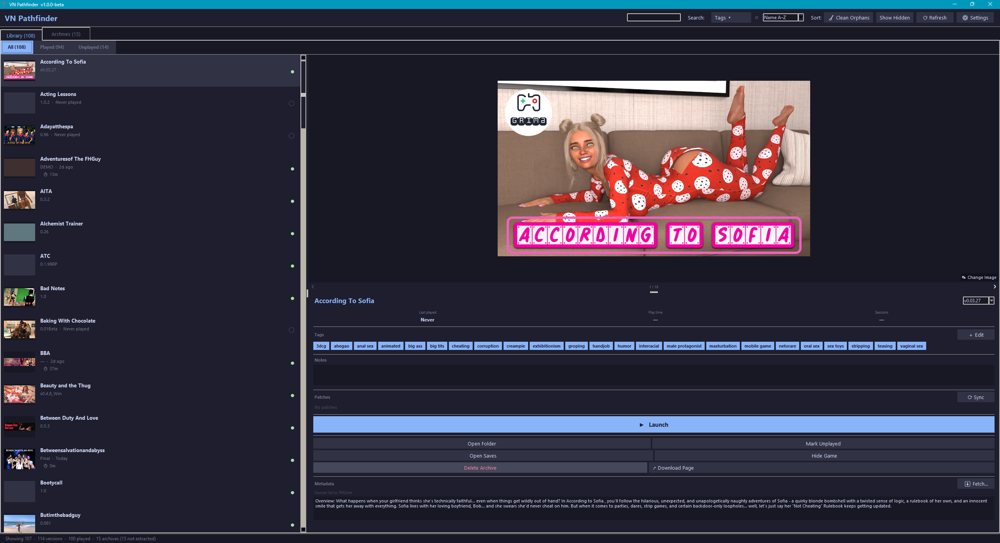
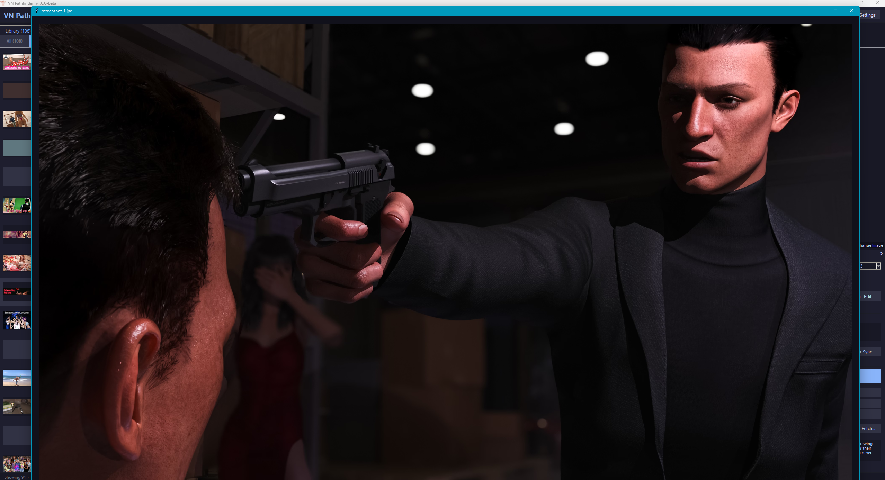
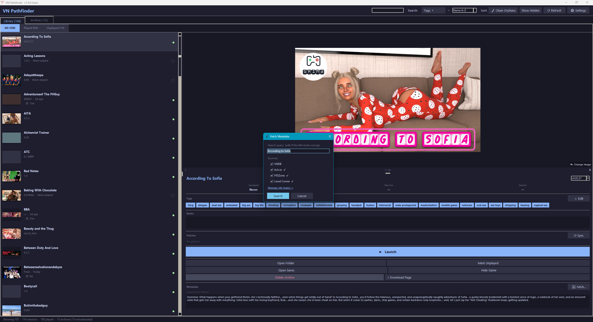
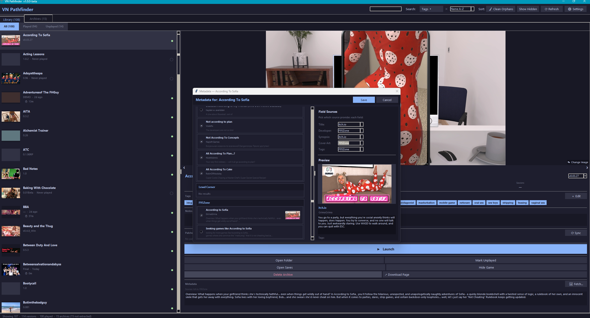
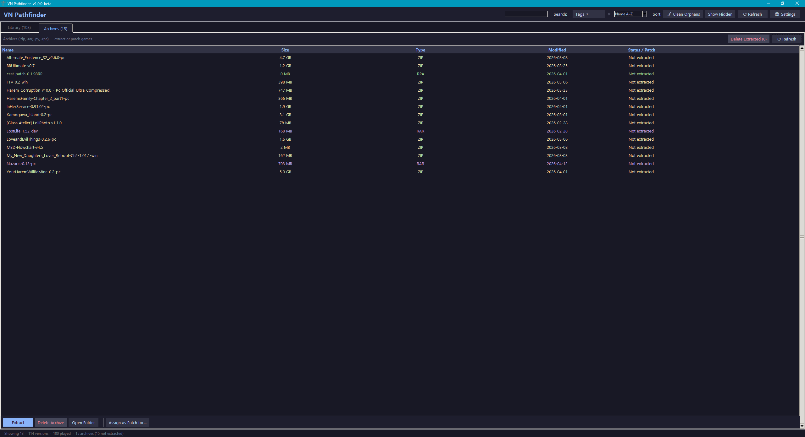
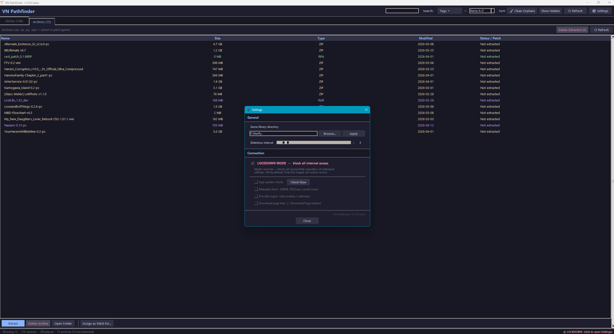

<div align="center">
  
  <h1>VN Pathfinder</h1>
  <p>Your complete visual novel library manager — track, organise, launch, and maintain your RenPy collection.</p>

  [](https://github.com/NikoCloud/VN-Pathfinder/releases/latest)
  [](https://github.com/NikoCloud/VN-Pathfinder/releases/latest)
  [](https://www.python.org/)
  [](LICENSE)
</div>

---

## Overview

VN Pathfinder is a standalone Windows desktop application for managing large local collections of RenPy visual novels. Whether you have tens or hundreds of titles, VN Pathfinder gives you a clean, fast interface to see what you have, what you've played, where your saves live, and how much disk space your archives are taking up.

Everything runs locally. No accounts. No telemetry. **Zero network access by default** — an optional metadata scraper and update checker are available but locked behind a master switch that is off out of the box.

---

## 🚀 VN Pathfinder 2.0 — Coming Soon

We're building a **complete rewrite** of VN Pathfinder using **Flutter** for true cross-platform support (Windows, macOS, Linux) with a modern UI and blazing-fast performance.

**[→ Follow VN Pathfinder 2.0 Development](https://github.com/NikoCloud/vn-pathfinder-flutter)**

1.0 is stable and feature-complete. 2.0 is in active development with the goal of reaching feature parity and beyond. Check out the 2.0 repo to see the roadmap, or [read the vision here](https://github.com/NikoCloud/vn-pathfinder-flutter#-why-flutter-why-now).

---

## Features

### Library
- **Card-based game list** with cover artwork auto-loaded from each game's assets — or fetched and stored from online metadata sources
- **Played / Unplayed tracking** via save file detection (`game/saves/` and `%APPDATA%\RenPy\`)
- **Play time counter** tracked automatically when you launch through the app
- **Last played date** and **play count** per game
- **Multi-version grouping** — multiple versions of the same game are grouped under one entry
- **Custom display names** and **notes** per game
- **Tag system** with colour-coded chips, built-in genre/status presets, user-promoted custom presets, and a bulk preset manager
- **Search, sort, and filter** by name, played status, and tags (AND / OR mode)

### Detail Panel
- **Screenshot carousel** — browse all artwork scraped from the source thread; auto-advances with a configurable slideshow timer
- **Cross-fade transitions** between carousel images
- **Click to fullscreen** — view any image at full resolution; navigate with arrow keys or ← ❮ ❯ → buttons
- **Resizable art area** — drag the sash to give more or less space to artwork
- **Hover overlay** — "Change Image" button appears on hover; supports multi-file select (first = cover, rest added as screenshots)
- **↗ Download Page** button — opens the game's source page (F95Zone, LewdCorner, itch.io) in your browser; shows a dropdown when multiple sources are saved

### Metadata Scraping *(opt-in)*
Fetch rich game information — title, developer, synopsis, cover art, screenshot gallery, and tags — from multiple sources and pick the best data field by field.

| Source | Login required | What it provides |
|--------|---------------|-----------------|
| **VNDB** | No | Title, developer, synopsis, cover art, tags |
| **F95Zone** | Username + password | Title, developer, synopsis, cover art, up to 19 screenshots, tags |
| **LewdCorner** | Username + password | Title, developer, synopsis, cover art, up to 19 screenshots, tags |
| **itch.io** | In-app browser | Title, developer, synopsis, cover art, screenshots |

- **Per-field source picker** — choose which site provides each individual field
- **Image manager in picker** — see every scraped image in a numbered list; promote any image to cover with ★ Cover, reorder with ▲ ▼, or remove unwanted images before saving
- **Images scoped to the game's first post** — never pulls in reply images, signatures, or avatars
- **Cover art and screenshots** downloaded in parallel and stored locally in `.vnpf/` — no repeated network calls
- **itch.io browser login** uses an embedded Chromium window so Cloudflare is handled automatically — no copying cookies or opening DevTools

### Archive Management
- **ZIP extraction queue** — non-modal, runs in the background
  - Byte-accurate progress bar with real-time MB/s and ETA
  - Cancel mid-extraction; post-completion **Clear** / **Clear & Delete ZIP** buttons
  - **Clear All & Delete ZIPs** for batch workflows
- **RAR extraction** — automatic via 7-Zip if installed; graceful manual fallback with instructions if not
- **Redundant archive detection** — finds ZIPs that already have an extracted counterpart, shows total wasted space, lets you bulk-delete in one click
- **Patch & Mod management** — non-destructive system for `.rpa`, `.rpy`, `.rpyc`, `.py`, and `.zip`/`.rar` patch archives
  - **Assign** moves a patch from your library root into the game's `.patches/` folder
  - **Enable / Disable toggles** in the Detail Panel move patches between `.patches/` (parked) and `game/` (active) — no copies, no permanent deletions
  - **Collision handling** — rename dialog with auto-suggested `name_YYYY-MM-DD` when a patch name already exists
  - **Version-aware** — patches are tracked per game version; switching versions in the Detail Panel shows that version's patch list
  - **⟳ Sync** button reconciles the UI with the real filesystem state

### Maintenance
- **Clean Orphaned Files** — scans library root for unrecognised items, lets you delete with checkboxes and size display
- **Delete Extracted Archives** — checklist of archives that already have an extracted game folder, with cumulative size counter

### Settings
- **Configurable library directory** — point the app at any folder, hot-reloads immediately without a restart
- **LOCKDOWN MODE** — master kill-switch for all network access, **on by default**. One toggle to unlock everything; one toggle to go offline again.
- Per-feature toggles for update checks, metadata scraping, site logins, and download page links
- **Slideshow interval** slider (0.5 – 30 seconds) for the detail panel carousel
- Lockdown indicator in the status bar — click it to open Settings

---

## Screenshots

### Library & Detail Panel

*Game list with cover art, colour-coded tags, synopsis, and action buttons — all in one view.*

### Fullscreen Artwork Viewer

*Click any image in the carousel to go fullscreen. Navigate with arrow keys or on-screen buttons.*

### Metadata Fetch — Source Selection

*Choose which sources to pull metadata from — F95Zone, LewdCorner, itch.io, and more.*

### Metadata Fetch — Results & Field Picker

*Pick the best result field by field. Preview cover art and screenshots before saving.*

### Archive & Patch Management

*All ZIPs, RARs, and patch files in your library root — with size, type, last-modified date, and one-click extraction.*

### Settings

*LOCKDOWN MODE is on by default — one toggle controls all network access. Point the app at any folder and it scans immediately.*

---

## Installation

### Option 1 — Installer (Recommended)

1. Download **`VNPathfinder_Setup.exe`** from the [latest release](https://github.com/NikoCloud/VN-Pathfinder/releases/latest)
2. Run the installer — places VN Pathfinder in Program Files with a Start Menu shortcut
3. On first launch, go to **⚙ Settings → General** and set your game library folder

### Option 2 — Portable EXE

1. Download **`VNPathfinder.exe`** from the [latest release](https://github.com/NikoCloud/VN-Pathfinder/releases/latest)
2. Place it **anywhere** — it doesn't need to live inside your games folder
3. On first launch, go to **⚙ Settings → General** and set your game library folder

> **Note:** Windows SmartScreen may warn about an unsigned binary on first run. Click *More info → Run anyway*.

### Option 3 — Run from Source

```bash
git clone https://github.com/NikoCloud/VN-Pathfinder.git
cd VN-Pathfinder
pip install -r requirements.txt
python vn_pathfinder.py
```

---

## Usage

### First launch
Open Settings (⚙ button, top toolbar) → **General** → set your game library folder. The app scans it immediately and populates the library.

### Library tab

| Action | How |
|--------|-----|
| Launch a game | Select it → **▶ Launch** |
| Fetch metadata | Select it → **⬇ Fetch…** in the detail panel |
| Mark as played/unplayed | Detail panel → **Mark Played / Unplayed** |
| Add/edit tags | Detail panel → **Edit Tags** |
| Rename a game | Detail panel → edit the display name field |
| Add notes | Detail panel → Notes text box (auto-saves on focus loss) |
| Hide a game | Detail panel → **Hide** |
| Filter by tags | Toolbar → **Tags ▾** — select one or more; toggle AND / OR mode |
| Clear tag filter | Toolbar → **✕** button next to Tags (lights up when active) |

### Metadata fetching

1. Select a game → click **⬇ Fetch…** in the detail panel
2. Edit the search query if needed, choose which sources to search, click **Search**
3. In the picker, select the best result from each source using the radio buttons
4. On the right panel, use the dropdowns to choose which source provides each field
5. In the **Images** list, reorder images or promote a different one to cover with **★ Cover**
6. Click **Save** — cover and screenshots are downloaded and stored locally

**Site logins** are managed via the login dialog inside the fetch screen, or directly from **⚙ Settings**:
- **F95Zone / LewdCorner** — enter username and password; a session token is saved locally, your password is never stored
- **itch.io** — click *Log in with browser*, log in normally in the window that opens, it closes automatically when done

### Detail panel artwork

| Action | How |
|--------|-----|
| Browse screenshots | ❮ / ❯ buttons, or Left / Right arrow keys |
| View fullscreen | Click the image |
| Navigate fullscreen | Arrow keys or ❮ / ❯ buttons |
| Change cover / add screenshots | Hover over image → **Change Image** button |
| Resize art area | Drag the sash between image and info |
| Adjust slideshow speed | **⚙ Settings → General → Slideshow interval** |

### Archives tab

| Action | How |
|--------|-----|
| Extract a ZIP or RAR | Select it → **Extract** |
| Delete already-extracted archives | Toolbar → **Delete Extracted (N) — X GB** |
| Assign a patch or mod | Select it → **Assign as Patch for…** → pick game (and version if multiple) |
| Enable / disable a patch | Game's Detail Panel → **Patches** section → toggle checkbox |
| Sync patch state with disk | Game's Detail Panel → **⟳ Sync** |

### Settings

| Setting | Default | What it does |
|---------|---------|--------------|
| Game library directory | *(set on first launch)* | Folder to scan for games |
| Slideshow interval | 3.5 s | Time between auto-advance ticks in the detail carousel |
| LOCKDOWN MODE | **On** | Master kill-switch — disables all network access |
| App update checks | On | Check GitHub for new releases on startup |
| Metadata fetch | On | Allow VNDB / F95Zone / LewdCorner / itch.io scraping |
| Provider logins | On | Allow site login dialogs |
| Download page links | On | Enable the ↗ Download Page button |

---

## Requirements

- Windows 10 / 11 (64-bit)
- [Microsoft Edge WebView2 Runtime](https://developer.microsoft.com/microsoft-edge/webview2/) — for the itch.io browser login. Already installed on most Windows 11 machines; Windows 10 users may need to install it manually.
- [7-Zip](https://www.7-zip.org/) *(optional)* — enables automatic RAR patch extraction. If not installed, RAR files prompt for manual extraction instead.

---

## Building from Source

Requires Python 3.10+, PyInstaller, and Inno Setup 6 (for the installer).

```bash
pip install -r requirements.txt
build.bat
```

Outputs in `dist/`:
- `VNPathfinder.exe` — portable single-file executable
- `VNPathfinder_Setup.exe` — full Windows installer (if Inno Setup is found)

Releases are built automatically by GitHub Actions on every version tag push.

---

## Roadmap

- [ ] Screenshots in README
- [ ] Export library to CSV / JSON
- [ ] Bulk tag assignment
- [ ] Series / franchise grouping
- [ ] Developer guide — best practices for packaging patches and mods for use with VN Pathfinder

---

## License

Apache License 2.0 — see [LICENSE](LICENSE)

Copyright 2025 NikoCloud
